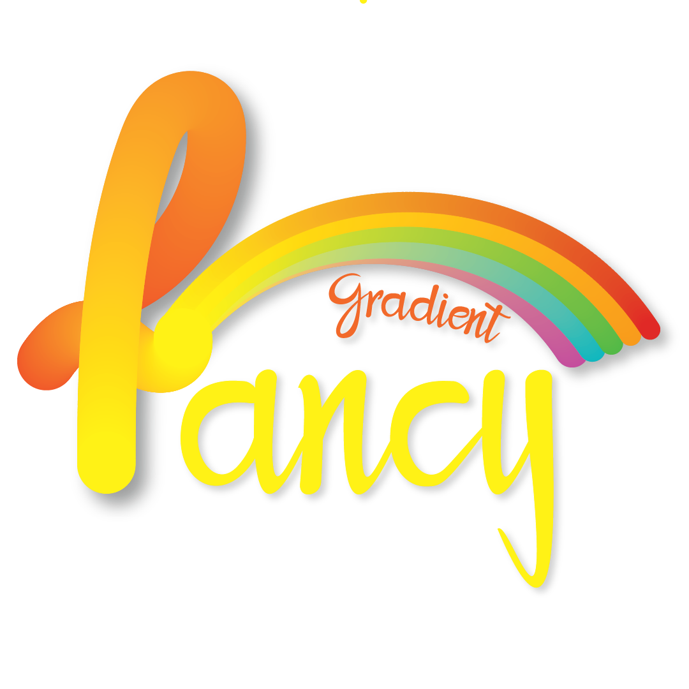

<div align="center">
    
</div>

[](https://github.com/Nikoloutsos/fancy-gradient/actions/workflows/ci.yml)
[](https://opensource.org/licenses/MIT)

FancyGradient is a UIView subclass which let's you animate gradients in your iOS app. It is purely written in Swift.


# Quickstart

Static gradient
```swift
let fancyView = FancyGradientView(colors: [UIColor.black, UIColor.orange],
                                  direction: .down,
                                  type: .axial)
view.addSubview(fancyView)
```

Animate your fancyView
```swift
// Animate the colors
fancyView.animate(newColors: [UIColor.red, UIColor.black], duration: 4)

// Animate the direction
fancyView.animate(newDirection: .left, duration: 4)
```

Be imaginative and come up with your animations 🌈
```swift
let myCustomAnimation = CustomAnimation()
            .then(EmptyAnimation(duration: 1)) // Delay 1 second
            .then(ColorAnimation(newColors: [UIColor.blue, UIColor.cyan], duration: 3)) // Color animation
            .then(ColorAnimation(newColors: [UIColor.cyan, UIColor.blue], duration: 3)) // Another color animation after previous finished
            .then(ColorAnimation(newColors: [UIColor.purple, UIColor.blue, UIColor.black], duration: 3))
            .then(DirectionAnimation(newDirection: .down, duration: 2))
fancyView.animate(animation: myCustomAnimation)
```


# Installation

## Cocoapods

# CustomAnimation
Custom animation supports almost every complex animations.

```swift
let myCustomAnimation = CustomAnimation(animID: "myAnimationID")
        .then(EmptyAnimation(duration: 1)) // Delay 1 second
        .then(
            CombineAnimation( // Run Direction and Color animation at the same time.(combine them)
                DirectionAnimation(newDirection: .right, duration: 1),
                ColorAnimation(newColors: [UIColor.black, UIColor.green], duration: 3)
            )
        )
        .then(DirectionAnimation(newDirection: .right, duration: 2))
        .then(DirectionAnimation(newDirection: .diagonalBottomLeftTopRight, duration: 2))
    fancyView.animate(animation: myCustomAnimation)
```

| Types  | Explanation |
| ------------- | ------------- |
| DirectionAnimation  | Animate gradient Direction |
| ColorAnimation  | Animate gradient colors |
| ColorStopsAnimation  | Animate the location of each gradient color stop|
| EmptyAnimation  | Does nothing. Useful for adding delay |
| CombineAnimation  | Combine 2 or more animations to start simultaneously |


# FancyGradientViewDelegate
Provide an implementation of FancyGradientViewDelegate to inform you when animation finished.

```swift
fancyView.delegate = self
```

```swift
extension ViewController: FancyGradientViewDelegate {
    func animationDidFinished(animId: String) {
        print("Finished animation \(animId)")
        // Tip: here you can show other UI elements after fisnished animation.
    }
}
```


and then
```swift

let myCustomAnimation = CustomAnimation(animID: "myAnimationID")
            .then(EmptyAnimation(duration: 1)) // Delay 1 second
            .then(ColorAnimation(newColors: [UIColor.blue, UIColor.cyan], duration: 3)) // Color animation after the delay
            .then(ColorAnimation(newColors: [UIColor.cyan, UIColor.blue], duration: 3)) // Another color animation after previous finished
            
fancyView.animate(animation: myCustomAnimation)
```
